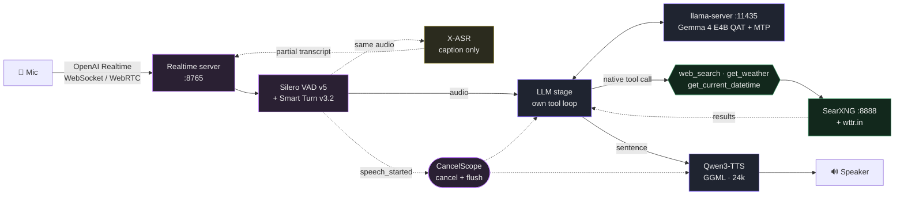

# Voice Chat — Streaming Speech-to-Speech with Tools, in zh-TW

**A fully local zh-TW voice agent on HuggingFace `speech-to-speech`.**
Silero VAD + Smart Turn → **Gemma 4 E4B hearing the speech directly** (own tool loop, real tools)
→ Qwen3-TTS, speaking the OpenAI Realtime protocol. There is no speech-to-text model on the
answering path; X-ASR runs beside it only to caption the screen. No hosted API, no mocks, no
cloud.

Speak, interrupt it mid-sentence, search the web, hear the answer.
**Traditional Chinese (Taiwan) throughout** — replies are zh-TW whatever language the question
was asked in, with English kept only for proper nouns and untranslatable terms.



## Architecture

Orchestration is [`huggingface/speech-to-speech`](https://github.com/huggingface/speech-to-speech)
0.2.12 (the pip package). It owns VAD, endpointing, TTS, transport and cancellation — each stage a
`BaseHandler` in its own thread, joined by queues. **Every component is local**; nothing calls a
hosted API.

Stages stay stock wherever one fits. The **LLM stage is the deliberate exception**: because it is
ours, it can take the VAD segment as *audio* and still call tools, which the framework's own audio
path cannot — that path hands audio to its chat-completions stage, which knows nothing about our
tools.

| | choice | notes |
|---|---|---|
| **Orchestrator** | `speech-to-speech` 0.2.12 | OpenAI Realtime server on `:8765`, WebSocket + WebRTC |
| **Turn-taking** | Silero VAD v5 + Smart Turn v3.2 | local ONNX; `--min_silence_ms 700` for Mandarin |
| **STT** | **none on the answering path** | the model hears the speech; X-ASR only captions the screen |
| **LLM** | `gemma-4-E4B-it-qat-UD-Q4_K_XL` + MTP head | llama-server `:11435`, `--mmproj` for audio, `--jinja` for native tool calls |
| **Agent** | own loop (`agent/native_loop.py`) | 3 tools, 3-step ceiling, arguments validated, results sanitised |
| **TTS** | `Qwen3-TTS-12Hz-0.6B-CustomVoice` Q8_0 | stock s2s handler on GGML CUDA, speaker `Vivian`, fed Simplified glyphs |
| **Search** | SearXNG `:8888` + wttr.in | real results only |
| **Embedding** | `granite-embedding-97m-multilingual` Q8_0 | `:11434`, semantic rerank |

**Why Gemma 4 E4B.** The QAT release is both smaller and better than plain Q4_K_M, and the MTP
(NextN) head ships as a separate 0.10 GB file that llama.cpp loads as a draft model — the
difference between **106 and 79 tok/s**. It also hears speech natively, which the rest of this
design depends on. Measured alternatives on the same card: Granite 4.2 3B Q4_K_M is faster
(113 tok/s) and unusable (很高养 for 很高興, Simplified leaking through a zh-TW prompt); Qwen3.5 9B
Q4_K_M runs at 47; Qwen3.6 35B-A3B with experts streamed from DRAM manages 41 and answered
台灣的首都 with mainland boilerplate.

### Native audio input, and no STT stage

`pipeline.sh` runs `--stt none`. `agent_handler` converts the VAD segment to an `input_audio`
content part and `native_loop` sends it with the tool schemas — the loop, the validation and the
sanitising are identical whether the prompt is text or speech. Spoken tool questions route from
audio alone:

| spoken | tool | first audio after speech ended |
|---|---|---|
| 請問現在是幾點鐘了呢？ | `get_current_datetime` | 2.1 s |
| 今天台北天氣如何？ | `get_weather` | 3.3 s |
| 今天有什麼新聞？ | `web_search` | — |

This also removes a failure mode: X-ASR once heard "huggingface" as "huninface" and the model
answered about Huawei. There is no transcription step left to corrupt.

**Endpointing is tuned for Mandarin.** HF's example uses `--min_silence_ms 300`; at that setting
VAD closed turns mid-question (喂，你好 arrived as 喂， 你), and the model answered the fragment.
Mandarin has intra-sentence pauses longer than 300 ms. **700 ms** costs 400 ms of endpointing and
buys whole utterances.

**Turns are remembered by this stage, because nothing else does it.** The framework fills its
shared `Chat` from a completed transcription — and with `--stt none` there is no STT stage to
raise one, while captions are deliberately *partial* events that mutate nothing. So the `Chat`
stayed empty and every turn was answered in isolation: asked 「我想請教一下啊」 the model offered a
weather lookup, and when the user said 「呃我不查天氣」 it asked *again* which region's weather —
amnesia, not stubbornness, since the utterance contains 天氣 and there was no prior turn for 不 to
negate. `agent_handler` now records each finished turn into the `Chat` itself:

| spoken | reply |
|---|---|
| 今天台北天氣如何？ | 今天台北的天氣預報是多雲，氣溫在攝氏 25 到 30 度之間。 |
| 那明天呢？ | 明天台北的天氣預報是…濕度為 90% — `get_weather`, 台北 carried over |
| 我剛剛問的是哪個城市？ | 我上一個回答是針對台北的氣象預報。 — from memory, no tool |

Past turns are replayed **as audio**, not as caption text, so X-ASR stays cosmetic and no ASR
error can enter the model's context. Only the last three spoken turns keep their audio (~26 prompt
tokens per second of speech); a **barged-in turn is never recorded**, since it never reached the
user.

Limits, measured rather than assumed: the "30 seconds" in Google's card is **per utterance, not
per session** — five consecutive audio turns worked, growing the prompt ~185 tokens each; a single
clip transcribed completely at 25 s and 40 s, while at 60 s the tail was silently dropped.

### The on-screen caption

X-ASR decodes the same audio as it arrives, so the caption builds while the user is still
speaking. Three properties keep it free, and each was got wrong first:

- **Teed, not staged.** Audio is copied inside `AudioHandler.append_pcm`, the one funnel every
  inbound chunk passes through, so no handler joins the chain. One non-blocking put; decoding is
  on a daemon thread, on CPU. 2.07 s median first audio with captions against 2.09 s without.
- **Published as a *partial*.** A *completed* transcription is added to the `Chat` by
  `RealtimeService` and reaches the model next turn — that cost 0.3 s.
- **Boundaries come from the pipeline's VAD**, not X-ASR's own endpointing. `speech_started`
  arrives a few hundred ms *into* the speech and the pipeline keeps that pre-roll, so audio is fed
  continuously and only *publishing* is gated — resetting the decoder dropped the opening words.

`S2S_CAPTION=0` turns it off.

### The voice, and why the TTS reads Simplified

`Qwen3-TTS-12Hz-0.6B-CustomVoice` has nine preset speakers, and the handler's default is
**`Aiden` — a sunny American male voice**, which the pipeline was using to speak Mandarin.
`pipeline.sh` now sets `--qwen3_tts_speaker Vivian`, measured best of the Chinese presets.

**The TTS is fed Simplified characters; the screen keeps zh-TW.** 「記得帶把傘喔」 was read with
the wrong syllable in 5 of 6 runs — 扇, 散, 線, 三, 山 — while the identical sentence written
记得带把伞哦 was correct 6 of 6:

| TTS input | 傘 correct |
|---|---|
| Traditional 記得帶把傘喔 | 1/6 |
| Simplified 记得带把伞哦 | **6/6** |

The failure is the **glyph**, not the voice. Vivian, Serena and Uncle_Fu all miss it; the
`instruct` line does not move it (2/6 vs 1/6, noise); and OmniVoice misses it too. Qwen3-TTS is
mainland-trained, so Traditional-only characters are rare tokens.

`serve.py` wraps the TTS stage and converts `TTSInput.text` with `zhconv` `zh-hans` before
synthesis. `LLMResponseChunk.text` is untouched, so the transcript the client renders stays
Traditional. The conversion is **character-level on purpose**, the same principle as the
frontend's `tw`-vs-`twp` split: 軟體 becomes 软体, *not* the mainland word 软件, and 網路/程式 are
left alone — it changes which glyphs are read, never the Mandarin that is said. Scope is modest
and worth stating: across six ordinary replies five were already perfect either way (mean CER
1.9% → 0.9%); the win is concentrated on rare glyphs, which is where it was audibly wrong.

**There is still no zh-TW voice in the model.** All Chinese presets are mainland-trained, and two
(`Dylan`, `Eric`) are explicitly Beijing and Sichuan dialects. Prosody can be steered and the
glyphs are now right, but the accent is not Taiwanese.

Two routes to a genuinely Taiwanese voice were evaluated and neither is adopted:

- **Voice cloning with the `Base` variant.** Works — the reference timbre transfers — but it
  garbles *short* sentences, which is all this demo produces: 「記得帶把鑰匙喔」 came back as
  记得代表真实哦. Needs a different GGUF; `Serveurperso/Qwen3-TTS-GGUF` is the repo the runtime
  itself resolves against, and its Q4 talker segfaults, so Q8 is the working quant. 0.6B and 1.7B
  were indistinguishable.
- **[OmniVoice](https://github.com/k2-fsa/OmniVoice)**, which upstream supports via
  `--tts omnivoice`. Its handler is on the framework's `main` but **not in the released 0.2.12**
  we run, and `main` has since dropped `get_tts_handler`, which `serve.py` substitutes — so
  adopting it means porting those hooks, not changing a flag. It also **does not stream**
  (upstream: "does not currently expose incremental audio through `generate()`"), runs at RTF
  0.56 against Qwen3-TTS's 0.17, and its weights are **CC-BY-NC**, where Qwen3-TTS is Apache-2.0.
  It missed 傘 as well.

### Tool calls are native, not prompted

`--jinja` makes llama.cpp apply Gemma's own chat template, so tools are declared in the request
and returned as structured `tool_calls`. Nothing parses prose for a JSON blob. Gemma's template
gives reasoning, tool calls and tool responses each their own framing
(`<|channel>thought`, `<|tool_call>`, `<|tool_response>`), which is why deliberation never reaches
the speaker.

Answers are shaped for speech: the system message asks for one or two spoken sentences with no
markdown. The same three questions dropped from 33/275/358 audio chunks to 18/51/87.

### Tool safety

Tool output is **untrusted input**. `agent/tool_guard.py`:

- `validate_args` checks types and required fields against the schema and drops undeclared ones,
  before the tool acts — a `web_search` with no arguments once ran a live lookup for the string
  "today".
- `sanitize_tool_output` strips chat control tokens (`<|im_start|>`, `<start_of_turn>`, …),
  prevents fence escape, caps length, and wraps the result in `<tool_output>`.

Prompt hardening alone is not sufficient and is not relied on: a forged turn inside tool text can
override a system prompt, so the stripping is what stops it. The system message additionally
declares `<tool_output>` untrusted.

### Barge-in

The framework's `CancelScope` handles it structurally: a generation counter is stamped on every
message, and a stale one is dropped wherever it surfaces. Cancellation fires on
**speech detection**, not end-of-utterance — the distinction is the whole feature on a long
answer. Measured: a 525-character answer (~40 s of speech) cancelled **1.29 s** after the user
started speaking, which is Silero's detection window. The client also flushes its own scheduled
audio, since chunks already queued in the `AudioContext` keep playing otherwise.

## Quick Start

Launch flags are the difference between working and not, so they live in checked-in scripts rather
than in this file, where they would drift.

```bash
SEARXNG_SETTINGS_PATH=/tmp/searxng/settings.yml python3 -m searx.webapp   # :8888
backend/s2s/deploy/llm-audio.sh      # Gemma 4 E4B QAT + MTP + audio projector, :11435
backend/s2s/deploy/pipeline.sh       # no STT stage, speech straight to the model, :8765
```

| variant | what it changes |
|---|---|
| `llm.sh` | no `--mmproj`: text only, ~1 GB less VRAM. Pair with `pipeline-stt.sh`. |
| `pipeline-stt.sh` | Paraformer transcribes and the model gets text — the pre-audio route |
| `pipeline-audio.sh` | HF's own `--stt none` example: the *framework's* stage, so **no tools** |
| `freetoken.sh` | Qwen3.6 35B-A3B with experts in DRAM |

Then talk to it with any Realtime client, or open the web UI:

```bash
speech-to-speech talk --url ws://127.0.0.1:8765/v1/realtime
cd frontend && npm install && npm run dev     # http://localhost:5173
```

Weights not pulled from the Hub on first use: LLM `/home/user/llms/gemma-qat/`, TTS
`/tmp/qwen3_tts/talker_cv_q8.gguf` + `codec.gguf`, embedding `/tmp/granite-emb-gguf/`,
SearXNG `/tmp/searxng/settings.yml`.

> **`/tmp` here is tmpfs — it is RAM, with a quota.** A multi-GB write fails partway with
> `Disk quota exceeded` even though `df` shows free space. Put new weights on a real disk.

### Reaching it from another machine

The client derives its endpoint from the page's origin, so the WebSocket must be reachable there
too.

- **Page on `http://`** — client uses `ws://<host>:8765`; the pipeline needs `--ws_host 0.0.0.0`.
- **Page on `https://`** — browsers block `ws://` from an https page as mixed content, so
  something must terminate TLS. The client uses `wss://<host>:8443`:

  ```bash
  tailscale serve --bg --https 8443 http://127.0.0.1:8765
  ```

  This stays **tailnet-only** and lets the pipeline stay bound to `127.0.0.1`, which is the point:
  the Realtime endpoint has **no authentication**. TLS is also what makes the microphone work at
  all — browsers grant `getUserMedia` only in a secure context.

Either default is only a default; the endpoint is editable in the UI.

### The frontend

`frontend/` is a Realtime client and nothing else — `realtime.js` (protocol), `audio.js` (capture,
playback), `endpoints.js` (URL building), `zhtw.js` (conversion), `App.svelte`. It holds no session
state and calls no HTTP API beyond the two read-only routes below.

**⬇ 記錄** downloads the session as one `.json`: the protocol trace both ways, the transcript,
client-only events, and latency counters. Audio payloads are elided, so a 300-chunk turn exports at
~48 KB instead of ~3.5 MB.

**Both sides are converted for display, by different rules.** OpenCC runs on each, but not the same
preset:

| | preset | why |
|---|---|---|
| user transcript | `tw` — characters only | a record of what was *said*, so it must stay phonetically invariant (臺北/台北 are both *tái-běi*) |
| assistant reply | `twp` — characters + vocabulary | the assistant's own words, so Taiwanese usage (軟件→軟體) is a correction, not a falsification |

Applying `twp` to the transcript would put words in it the user never said — 用鼠标点击 becomes
用滑鼠點選 (*shǔbiāo diǎnjī* → *huáshǔ diǎnxuǎn*).

## Features

- **Barge-in on speech detection**, not end-of-utterance.
- **No speech-to-text on the answering path.** Gemma 4 hears the audio and routes tools from
  speech alone; X-ASR captions from a side path that never enters the pipeline.
- **Multi-turn memory on the audio path.** Follow-ups resolve against earlier turns
  (「那明天呢？」 keeps the city), with past speech replayed as audio.
- **Real tools**, called natively: `web_search`, `get_weather`, `get_current_datetime`, with
  arguments validated and results fenced as untrusted data.
- **zh-TW throughout**, whatever language the question was asked in — and the TTS is fed
  Simplified glyphs so Traditional-only characters are pronounced correctly, while the
  transcript on screen stays Traditional.
- **Answers sized for speech** — one or two spoken sentences, no markdown.
- **Thinking never spoken.** Deliberation stays in `reasoning_content`.
- **Live captions**, a VRAM readout, and a debug export of the whole session.

## Measured (RTX 3060, live stack)

Spoken turns over the Realtime protocol, timed from end-of-speech:

| spoken | tool | first audio |
|---|---|---|
| 請問現在是幾點鐘了呢？ | `get_current_datetime` | 2.1 s |
| 今天台北天氣如何？ | `get_weather` | 3.3 s |
| 今天有什麼新聞？ | `web_search` | — |

Generation, Gemma 4 E4B QAT UD-Q4_K_XL (4.22 GB), greedy:

| | decode |
|---|---|
| **with MTP** (default) | **106 tok/s** |
| without MTP | 79 tok/s |

Decode is memory-bandwidth-bound; MTP's self-speculation is what pushes past the single-token
bound. Qwen3-TTS TTFA is 0.02–0.08 s at RTF ~0.2, so a tool turn's latency is the lookup
round-trip, not synthesis. The X-ASR caption reaches the client at **+0.89 s**, ahead of first
audio. Barge-in cancels **1.29 s** after speech starts.

## Configuration

| Env | Default | Purpose |
|---|---|---|
| `S2S_LLM_API_BASE` / `S2S_LLM_MODEL_NAME` | `…:11435/v1` / `gemma-4-e4b-qat` | which llama-server the LLM stage talks to |
| `S2S_USE_UPSTREAM_LLM` | unset | `1` runs the stock s2s LLM stage (loses the tools) |
| `LLM_AGENT_MAX_STEPS` | `3` | tool-loop ceiling: tool → observe → answer |
| `LLM_AGENT_MAX_TOKENS` | `2048` | per-turn cap (thinking + tool call + answer) |
| `LLM_AGENT_THINKING` | `1` | thinking pass |
| `LLM_AGENT_TEMP` / `LLM_AGENT_TOP_P` | `0.7` / `0.9` | agent-turn sampling |
| `LLM_AGENT_SEED` | unset | reproducible agent turns |
| `LLM_REQUEST_TIMEOUT` | `45` | a hung call must not hold the only pipeline slot |
| `S2S_CAPTION` / `S2S_CAPTION_DEVICE` | `1` / `cpu` | the X-ASR caption, and where it runs |
| `VOICE_TZ` | `Asia/Taipei` | timezone `get_current_datetime` reports by default |
| `SEARXNG_URL` | `http://localhost:8888` | search backend for `web_search` |
| `LLM_PATH_GEMMA` / `LLM_PATH_GEMMA_MTP` | see `llm_manager.py` | weights and MTP draft head |
| `LLM_MTP` / `LLM_MTP_DRAFT_N` | `1` / `3` | self-speculative decoding |
| `TTS_MODEL_DIR` | `/tmp/qwen3_tts` | TTS GGUF location |

The TTS speaker and instruct are set in `s2s/deploy/pipeline.sh`, not by env.

## API

The interface is the OpenAI Realtime protocol on `:8765` — any client implementing the core
event set works, including the framework's own `speech-to-speech talk`.

**Client → server:** `session.update`, `input_audio_buffer.append`,
`conversation.item.create`, `response.create`, `response.cancel`.

**Server → client:** `input_audio_buffer.speech_started` / `speech_stopped`,
`conversation.item.input_audio_transcription.delta` / `.completed`,
`response.output_audio.delta`, `response.output_audio_transcript.done`, `response.done`.

Three details decide whether a client behaves correctly:

- **`input_audio_transcription.delta` is cumulative.** Each carries the whole transcript so far,
  not the increment, so partials must *replace*. Appending yields 「欢迎欢迎大家来欢迎大家来体验…」.
- **A voice turn never emits `response.created`** — the server sends it only for an explicit
  `response.create`. End-of-speech is what signals that a reply is coming.
- **With an audio response the assistant text arrives on
  `response.output_audio_transcript.done`**, once per spoken chunk, so those accumulate rather
  than replace.

Input audio is base64 PCM16 at the server's 16 kHz pipeline rate, and the input format must not
be declared: `AudioPCM.rate` is `Literal[24000]` in the schema, so sending the real 16 kHz
rejects the entire `session.update`. Output declares 24000, the rate Qwen3-TTS produces.

One session at a time by default (`--num_pipelines 1`); further connections are rejected. Each
extra pipeline has its own STT/TTS handlers and costs VRAM.

Three routes are added by `s2s/serve.py`, not upstream:

Two read-only routes are added by `s2s/serve.py`, not upstream:

- `GET /v1/llm-config` — which model is serving, so the UI's pipeline card is derived rather than
  hardcoded (a fixed string went stale the moment the model changed).
- `GET /v1/vram` — GPU memory for the UI's readout. The browser speaks only the Realtime protocol
  and has no backend of its own, so this rides on the same server. Both install permissive CORS
  for GET, which the framework ships none of; that is fine for WebSockets but would block the
  fetch whenever the page is served from a different origin.

## Security

**The Realtime endpoint has no authentication.** Anyone who can reach `:8765` can drive the LLM
and the GPU.

| Control | Practice |
|---|---|
| Binding | `--ws_host 127.0.0.1`; expose with `tailscale serve`, which stays tailnet-only |
| Never | Funnel it, or bind it to a public interface |
| TLS | required for microphone access from another machine |
| SearXNG | loopback only; reachable from the tool, not from the client |

## Validating a change

`tests/` has no `__init__.py`, so `unittest discover` cannot import it — use pytest. On a
PEP 668 distro (`externally-managed-environment`) install it into a venv:
`python3 -m venv --system-site-packages .venv && .venv/bin/pip install pytest`.

```bash
cd backend && python3 -m pytest tests/ -q       # 152 tests, no GPU or network
ruff check backend --config ruff.toml           # gate: E4, E7, E9, F, B

# the whole stack against a running pipeline; exits non-zero on failure
cd backend && python3 -m s2s.checks.exhaustive          # --quick skips spoken turns

# against a LIVE pipeline on :8765 (close the browser tab first -- one session slot)
cd backend  && python3 -m s2s.checks.turn "台灣的首都是哪裡？"
cd backend  && python3 -m s2s.checks.bargein
cd frontend && node checks/turn.mjs             # a voice turn through the UI's own client
cd frontend && node checks/bargein.mjs
cd frontend && node checks/log.mjs              # debug export; no server needed
cd frontend && node checks/zhtw.mjs             # transcript conversion; no server needed
cd frontend && node checks/endpoints.mjs        # URL building; no server needed
```

`s2s/checks/exhaustive.py` covers what unit tests cannot: the added HTTP routes, tool routing and
fabrication across all prompt shapes, error legibility, and barge-in. Two of its assertions exist
because a weaker version passed while the demo was broken — the clock check compares month and day,
not just the year, and barge-in asserts that no audio arrives *after* cancellation rather than
counting chunks during the detection window.

> The server runs **one session at a time** (`--num_pipelines 1`); an open browser tab holds that
> slot. Each extra pipeline has its own handlers and costs VRAM.

Writing a UI-level sweep? **Assert on what the UI renders** — a harness accumulating raw tokens
while the client renders reconciled text reports green against a transcript no user sees. And
**check the answer bubble separately from the audio**: text kept out of speech can still reach the
transcript.

## License

Code Apache-2.0. Models: Gemma 4, Qwen3-TTS, Granite-embedding-97M, X-ASR, Paraformer, Silero VAD,
Smart Turn v3.2 (Apache-2.0/MIT); SearXNG AGPL-3.0.
Orchestration: [huggingface/speech-to-speech](https://github.com/huggingface/speech-to-speech).
