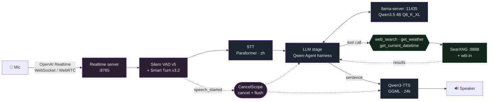

# Voice Chat — Streaming Speech-to-Speech with Tools, in zh-TW

**A fully local zh-TW voice agent on HuggingFace `speech-to-speech`.**
Silero VAD + Smart Turn → Paraformer → Qwen3.5 4B (Qwen-Agent, real tools) → Qwen3-TTS,
speaking the OpenAI Realtime protocol. No hosted API, no mocks, no cloud.

Speak, interrupt it mid-sentence, search the web, hear the answer.
**Traditional Chinese (Taiwan) throughout** — replies are zh-TW whatever language the question
was asked in, with English kept only for proper nouns and untranslatable terms.



## Built on HuggingFace speech-to-speech

The orchestration is [`huggingface/speech-to-speech`](https://github.com/huggingface/speech-to-speech)
(the pip package `speech-to-speech`), not hand-rolled. It owns the pipeline: VAD, endpointing,
STT, TTS, the transport, and cancellation. Each stage is a `BaseHandler` in its own thread,
joined by queues.

Two things worth stating plainly, because both are easy to get wrong:

- **`transformers.pipeline("speech-to-speech")` does not exist.** There is no such task
  (v5 exposes `automatic-speech-recognition`, `text-to-audio`, `audio-classification`). The
  framework here is the separate `speech-to-speech` package. An older orchestrator in
  `backend/pipeline/` advertised a compatibility shim for that non-existent task; it is not
  the live path.
- **Every component is local.** HuggingFace supplies weights and the framework; nothing calls
  a hosted API. The LLM runs on llama.cpp, TTS on GGML through `faster_qwen3_tts`, STT on
  FunASR, VAD and Smart Turn on local ONNX.

Components are kept **native to the framework** wherever one exists — Paraformer for Chinese
STT, the stock Qwen3-TTS handler (pointed at GGUF weights already on disk), Silero VAD, Smart
Turn. The single deliberate exception is the LLM stage.

### Why the LLM stage is ours

`speech-to-speech` can talk to any OpenAI-compatible server, including llama-server, and has
its own tool-calling layer — so the stock `chat-completions` backend would work. The stage is
replaced anyway (`backend/s2s/qwen_agent_handler.py`) so the turn is driven by **Qwen-Agent**,
whose tool loop and prompt handling this project already depends on. Substituting the one
factory function `s2s_pipeline.get_llm_handler` is enough; there is no fork to rebase.

**Tools run server-side.** The Realtime protocol expects the *client* to execute a tool and
post `function_call_output` back, which cannot work here: `web_search` talks to SearXNG on
127.0.0.1 and the clock and weather tools are backend resources. Qwen-Agent's own
call → observe loop stays intact and the browser receives ordinary assistant text.

### Barge-in

Handled by the framework's `CancelScope`, and it is structural rather than per-call-site: a
generation counter that `BaseHandler.should_process_input` checks, so every stage inherits
cancellation instead of each one remembering to. On `speech_started` the send loop cancels,
flushes the queues, and drops output tagged with a superseded generation.

Smart Turn v3.2 adds semantic endpointing on top: an ambiguous pause starts STT and the LLM
speculatively, and if the user resumes, the turn is reopened as a new revision and the earlier
work is discarded before it reaches the speaker.

Measured: a 525-character answer (~40 s of speech) was cut **1.29 s** after the user started
talking — `response.done status=cancelled reason=turn_detected` — which is Silero's detection
window. Long answers were exactly the case the previous hand-written turn machine got wrong.

## Stack

| Layer | Model / Service | Notes |
|---|---|---|
| **Orchestrator** | `speech-to-speech` 0.2.12 | OpenAI Realtime server on `:8765`, WebSocket + WebRTC |
| **Turn-taking** | Silero VAD v5 + Smart Turn v3.2 | local ONNX; speculative turns with revisions |
| **STT** | Paraformer (FunASR) | Chinese-oriented; `pip install "speech-to-speech[paraformer]"` |
| **LLM** | `Qwen3.5-4B-UD-Q8_K_XL` | llama-server `:11435`, MTP on, thinking on, 3 tools |
| **Agent** | `qwen-agent` `Assistant` | custom s2s LLM stage; tools execute server-side |
| **TTS** | `Qwen3-TTS-12Hz CustomVoice` Q8_0 | stock s2s handler on GGML CUDA, ~20-80 ms TTFA |
| **Search** | SearXNG `:8888` + wttr.in | 180 engines, real results only |
| **Embedding** | `granite-embedding-97m-multilingual` Q8_0 | 384 d, `:11434`, semantic rerank |

### Models

One model, deliberately. `Qwen3.5 4B UD-Q8_K_XL` is the reference everything is validated
against. Perplexity over 194 kB of non-repeating zh-TW Wikipedia prose — a deterministic
measure, unlike the four-prompt UI matrix whose spread is noise:

```
2B  UD-Q8_K_XL 16.738   UD-Q4_K_XL 17.080   Q4_K_M 17.091
4B  UD-Q8_K_XL 13.027   UD-Q4_K_XL 13.173
```

Dropped, all measured here: **Qwen3.5 2B** (the 4B is simply better and the VRAM is there);
**Bonsai 8B ternary** (8.2 B params in 2.18 GB is real compression, but it lost to the 2B in
tokenizer-independent bits/byte, 1.0786 vs 0.9652, and needed a second llama.cpp binary —
Prism's fork — to load at all); **Ling 3.0 tiny** (no better, slower, more VRAM, and drifted
into Simplified Chinese, which this demo must not do).

For integration convenience the framework also accepts `--llm_backend transformers`, which
would run int8 safetensors in-process instead of llama.cpp.

### A minimal harness

The harness declares three real tools, a system prompt, and the agent loop. Nothing inspects
the model's answer to decide what it "should" have done.

It used to. A layer of hand-written Chinese regexes read each answer and then re-ran tools,
spliced results in, rewrote sentences, or forced a tool before the model had spoken. Measured
against the 4B it cost more than it bought — `現在幾點？` took **28.9 s** and the model read its
own deliberation aloud, because it was narrating the tool result the pre-flight had injected
rather than answering. Without the layer the same question is correct in **3.3 s**. Steering by
regex also made the routing metric measure the guard instead of the model.

The one behaviour worth keeping became a tool default rather than a guard:
`get_current_datetime` defaulted to UTC, so an unargumented call — the common case — announced
"早上 05:42 (UTC)" to a user for whom it was 13:42 in Taipei. It now defaults to `VOICE_TZ`.


## Quick Start

```bash
# 1) Search backend (tools)
SEARXNG_SETTINGS_PATH=/tmp/searxng/settings.yml python3 -m searx.webapp   # :8888

# 2) LLM
llama-server -m /home/user/llms/mtp/Qwen3.5-4B-UD-Q8_K_XL.gguf \
  --host 127.0.0.1 --port 11435 -c 8192 --alias qwen3.5-4b \
  --n-gpu-layers 99 --jinja --reasoning-format deepseek

# 3) The speech-to-speech pipeline, with Qwen-Agent as its LLM stage
cd backend && python3 -m s2s.serve --mode realtime \
  --ws_host 127.0.0.1 --ws_port 8765 \
  --stt paraformer --language zh \
  --model_name qwen3.5-4b \
  --responses_api_base_url http://127.0.0.1:11435/v1 --responses_api_api_key none \
  --tts qwen3 --qwen3_tts_backend ggml --qwen3_tts_language zh \
  --qwen3_tts_gguf_talker_path /tmp/qwen3_tts/talker_cv_q8.gguf \
  --qwen3_tts_gguf_codec_path  /tmp/qwen3_tts/codec.gguf \
  --enable_live_transcription
```

Then talk to it — any OpenAI Realtime client works, including the framework's own:

```bash
speech-to-speech talk --url ws://127.0.0.1:8765/v1/realtime
```

Or check it without a microphone:

```bash
cd backend
python3 -m s2s.checks.turn "台灣的首都是哪裡？"   # one turn: transcript + latencies
python3 -m s2s.checks.bargein                     # interrupt a long answer with real audio
```

Dependencies beyond `requirements.txt`:

```bash
pip install "speech-to-speech[paraformer]"    # Paraformer STT through FunASR
```

Weights are pulled from the Hub on first use (Silero VAD, Smart Turn v3.2, Paraformer) except
the two already on disk: LLM `/home/user/llms/mtp/Qwen3.5-4B-UD-Q8_K_XL.gguf`, TTS
`/tmp/qwen3_tts/talker_cv_q8.gguf` + `codec.gguf`. Embedding
`/tmp/granite-emb-gguf/…Q8_0.gguf` · SearXNG `/tmp/searxng/settings.yml`.

> **`/tmp` here is tmpfs — it is RAM, and it enforces a quota.** A multi-GB write fails partway
> with `Disk quota exceeded` even though `df` shows free space. Put new weights on a real disk
> and point the matching `LLM_PATH_*` at them.

### The earlier pipeline

`backend/app.py` (`:8000`) still serves the hand-rolled FastAPI/WebSocket stack and the Svelte
UI, on X-ASR streaming STT and its own turn machine. It is the thing the speech-to-speech
pipeline replaces; keep it for comparison, not for new work.

```bash
cd backend  && python3 app.py --port 8000
cd frontend && npm install && npm run dev
```

## Features

- **Full-duplex barge-in, either direction.** Speaking over a reply cancels it — voice over
  voice, voice over text, or the button — on the *first partial transcript*, not when the user
  stops talking. That distinction is the whole feature on a long answer.
- **Tool-aware.** `web_search`, `get_weather`, `get_current_datetime`, with pre-flight routing
  for questions whose form requires a lookup.
- **zh-TW first.** Default voice, UI text and demo prompts are Traditional Chinese; the display
  layer uses OpenCC's phrase-aware `s2twp` as a safety net.
- **Thinking shown, never spoken.** Deliberation streams to a collapsible panel, kept out of
  both the audio and the transcript.
- **Low latency.** Svelte 5 + AudioWorklet + binary WS, whole-sentence TTS flush, 0.6 s pre-roll.

## Measured (RTX 3060, live stack)

### speech-to-speech pipeline · Qwen3.5 4B Q8 · minimal harness

End to end over the Realtime protocol, fully local, cold client each time:

| Prompt | First audio | Total |
|---|---|---|
| 台灣的首都是哪裡？ | 2.55 s | 2.94 s |
| 現在幾點？ (clock tool) | 3.32 s | 4.24 s |
| 你好 | 1.70 s | 2.18 s |
| 今天台北天氣如何？ (search tool) | 7.1–10.2 s | 11.7–20.2 s |

Qwen3-TTS time-to-first-audio is 0.02–0.08 s at RTF 0.2–0.25, so a tool turn's latency is the
search round-trip, not synthesis. **Barge-in: a 525-character answer cancelled 1.29 s after the
user started speaking** (`status=cancelled reason=turn_detected`), which is Silero's window.

Removing the regex guard layer moved the clock turn from 28.9 s — with the model reading its
own deliberation aloud — to 4.2 s and correct. Fixing the latin-centric `len > 2` candidate
filter took short Chinese answers from 3-of-6 replaced by an apology to 8-of-8 answered.

### Earlier pipeline (`app.py`, X-ASR + hand-rolled turn machine)

| Metric | Value |
|---|---|
| STT accuracy | 100 %, CER 0.000 (`asr_example.wav`, 5 runs) |
| First audio — plain / tool turn | 0.4–2.0 s / 1.5–7.0 s (search round-trip dominates, not decode) |
| LLM TTFT (p50) · TTS TTFB (p50) | 0.05–0.58 s · 0.34–0.88 s |
| E2E (p50 / max) | 1.3–2.7 s / 7–19 s (whole answer synthesized, so it scales with length) |
| Barge-in | 3/3 — text→text, voice→voice, voice→text |
| Tool-call selection | 83 % mean, 71–100 % over 6 passes |
| RSS | ~3.0 GB idle, ~3.3 GB peak |

Tool routing is temperature-sensitive: every number is a spread, not a point. Fix
`LLM_AGENT_SEED` to compare builds.

**Thinking on vs. off** (3 passes each) — off is 7× faster to first token and *worse*, because
its failures are fabrications rather than misses:

| Config | Tool accuracy | TTFT p50 | What the user heard |
|---|---|---|---|
| thinking in `content` | 81 % | 1384 ms | answers, plus the scratchpad read aloud |
| thinking off | 71 % | 56 ms | fast, clean, invented: weather never looked up |
| thinking + `--reasoning-format deepseek` | **83 %** | **53–576 ms** | answers only |

**Two rules for comparing models**, both learned the hard way:

- *Perplexity ranks only models sharing a tokenizer.* It is per-token, so a tokenizer packing
  more text per token predicts a harder target and scores worse without being worse — Bonsai
  turns the eval corpus into 131 k tokens where Qwen produces 117 k. Across families use
  **bits per byte**: `tokens × ln(PPL) / (ln 2 × corpus_bytes)`. Numbers above are
  `llama-perplexity -c 2048` over 194 kB of non-repeating zh Wikipedia prose.
- *The four-prompt matrix cannot rank builds.* Two runs of the same weights differing only by a
  throughput feature scored 6/8 and 4/8; four near-equivalent configs gave 4, 5, 6, 4. At n=8
  and temperature 0.7 that is the noise floor. Treat it as an end-to-end smoke test.

**MTP** (Qwen entries): the weights carry NextN layers, so the model drafts its own next tokens
and the target verifies them — accepted drafts are what would have been generated anyway.
Measured +20 % on 4B with byte-identical greedy output. `LLM_MTP=0` disables it; `--spec-type`
is probed, so a build without it still starts.

To make a turn feel faster, look at the thinking budget and the search round-trip, not the model
size — decode is a small fraction of first audio.

## Design notes

Each rule exists because the obvious version misbehaved in a way that reached the user.

**Nothing the machine says to itself is an answer.** Reasoning reaches the client as its own
`reasoning` event, never as speech. Four other things look like answers and are not: our system
prompt replayed back (matched by shingle overlap, so paraphrases are caught), qwen-agent's
Simplified-Chinese tool narration, the model's own checklist scaffolding (`Evaluate the Input:`),
and any standalone sentence-length all-English span — answers here are zh-TW with English only
*inside* a Chinese sentence. Detection is shape-based, never a list of observed phrases.

A single token is too small a unit to classify, so a sentence recognized as reasoning only after
streaming is *retracted* from the transcript as well as withheld from speech
(`ling_streaming.retract_span`). Both paths accumulate `text_so_far` locally — adopting the
harness's cumulative copy restores what was just removed. If nothing survives, the turn falls
back to a spoken "no answer" rather than showing scaffolding in silence.

**Nothing is said twice.** The harness streams deltas live, then reconciles against the
authoritative final text and speaks only the remainder. Two ways that broke: comparing raw
streamed text against a whitespace-collapsed `final_text` (any answer opening with a newline
replayed in full), and `final_text` being a filtered *subset* of what streamed, once reasoning
sentences are dropped. Both sides are normalized and containment is checked first
(`tests/test_stream_replay.py`). Audio was always fine — `SpokenGuard` refuses a repeat — so this
only ever showed in the transcript, which is why it read as model repetition for so long.

**The language instruction is stated once, in the system prompt**, never appended to the user's
turn. Glued onto the transcript it became part of what the model was asked: copied verbatim into
`web_search` queries and read back aloud as the answer.

**Some questions are routed by form, not the model's judgement.** The current date and a current
office holder are no more in the weights than tomorrow's weather, so
`required_tool_for_request()` invokes the tool before the model speaks. The Chinese patterns
match ordinary word order (`總統是誰`) as well as verb-first `誰是`; matching only the latter left
this demo's own `法國現在的總統是誰？` chip answered from memory. Lookup intent is tested before the
clock so `現在` doesn't become a time query. `_preflight_enabled()` turns it off to measure the
bare model.

Three repair guards catch assertions nothing verified: a tool the model only *named*, a
fabricated clock, and a fabricated forecast. Each runs the real tool — visible in the UI via its
own events — and either splices the value in or takes one corrective turn. A pre-flighted tool
counts as a tool that ran, or the guards fire on correct answers.

**Markdown is not speech.** Handing `**bold**` to an acoustic model produced 65 % CER on those
sentences. `tts/spoken_text.py` is the single front-end for both TTS entry points; it rewrites
notation only (markup, `°C`→`度`, `68%`→`百分之68`, emoji, URLs), never content, and reports which
rules fired. Text is then segmented by script and synthesized with an explicit per-segment
language, so a term quoted mid-sentence isn't pronounced as Chinese.

**Search is honest.** No curated results. Chinese queries are tokenized with jieba before
relevance scoring — a regex treats an unsegmented phrase as one token, which scored every Chinese
query at zero and silently disabled the fallback chain. Fallback backends race concurrently
rather than each waiting out its own timeout.

## Configuration

| Env | Default | Purpose |
|---|---|---|
| `VOICE_CHAT_TOKEN` | — | auth token (`--token` alias) |
| `ALLOWED_ORIGINS` / `ALLOW_CREDENTIALS` | dev origins / off | CORS |
| `WS_ALLOW_ANY_ORIGIN` | off | opt out of the WebSocket Origin gate |
| `SEARXNG_URL` | `http://localhost:8888` | search backend |
| `LLM_API_BASE`, `LLM_PORT`, `LLM_CTX`, `LLM_DEFAULT_MODEL_ID`, `LLM_PATH_*` | see `llm_manager.py` | LLM subprocess |
| `VOICE_TZ` | `Asia/Taipei` | timezone `get_current_datetime` reports when the model passes none |
| `S2S_LLM_API_BASE` / `S2S_LLM_MODEL_NAME` | `…:11435/v1` / `qwen3.5-4b` | which llama-server the speech-to-speech LLM stage talks to |
| `S2S_USE_UPSTREAM_LLM` | unset | `1` runs the stock s2s LLM stage instead of Qwen-Agent |
| `LLM_MTP` / `LLM_MTP_DRAFT_N` | `1` / `3` | self-speculative decoding on MTP weights |
| `LLM_SEED` / `LLM_AGENT_SEED` | random / unset | reproducible runs |
| `LLM_AGENT_TEMP`, `LLM_AGENT_TOP_P` | `0.7`, `0.9` | agent-turn sampling |
| `LLM_AGENT_THINKING` | `1` | thinking pass on agent turns |
| `LLM_AGENT_NO_TOOL_SMALLTALK` | `1` | greetings get a reply, not a tool call |
| `LLM_REASONING_FORMAT` | `deepseek` | keeps thinking out of `message.content` |
| `VOICE_TZ` | `Asia/Taipei` | timezone spoken by the datetime tool |
| `EMBED_API_BASE`, `EMBED_MODEL` | `:11434` | semantic rerank |
| `TTS_MODEL_DIR`, `STT_MODEL_DIR` | `/tmp/…` | model locations (Docker mounts) |

## API

| Endpoint | Description |
|---|---|
| `GET /health` | models, RSS, mock flag, SearXNG status, auth mode. Public; `?verbose=1` adds latency history and needs a token |
| `WS /ws/chat?session_id=…` | binary PCM (`0x01` audio / `0x02` flush / `0x03` barge-in) or JSON (`start`/`audio_chunk`/`stop`/`barge_in`/`text_input`) → `stt_partial`/`stt_final`/`llm_token`/`llm_reset`/`reasoning`/`tool_call`/`tool_result`/`tts_start`/`tts_chunk`/`tts_end`/`latency`/`barge_in`, each tagged with `turn_id` |
| `POST /api/chat` | JSON chat (non-streaming) |
| `GET /api/search?q=…` | SearXNG search |
| `GET /stats` | counters and latency percentiles |
| `GET` / `POST /api/model` | list / switch the loaded LLM (~1–2 s). Loopback-only unless a token is set |

`llm_reset` tells the client to discard a partial bubble: the agent can stream text then withdraw
it when a tool call appears mid-stream. Nothing withdrawn was ever spoken.

## Security

| Control | Default |
|---|---|
| `VOICE_CHAT_TOKEN` | unset = open dev mode. When set, `/api/*`, `/ws/chat`, `/search`, `/stats` require `X-Auth-Token`, `Authorization: Bearer`, or `?token=` |
| Model switching | loopback-only without a token — it restarts llama-server and silences every session |
| CORS | explicit dev-origin list, no credentials; wildcard + credentials refused and logged |
| WebSocket handshake | 403 before `accept()` unless the Origin is same-origin, loopback, or allow-listed. **CORS does not cover WebSockets** — without this any page could open a live mic session from a visitor's browser |
| `/search?format=html` | output escaped; only `http(s)` becomes a link |

Publishing this port? Set `VOICE_CHAT_TOKEN` first — the backend warns at boot when bound to a
non-loopback host without one.

## Validating a change

```bash
python3 -m unittest discover -s backend/tests -v   # pure logic, no GPU/network (CI)
python3 backend/check_env.py                       # is this interpreter complete?
python3 backend/check_requirements.py              # will the pins install in the image?
ruff check backend --config ruff.toml              # gate: E4, E7, E9, F, B

# against a LIVE deployment
python3 backend/test_e2e_report.py --server http://127.0.0.1:8000
python3 backend/test_bargein_voice.py              # speak over a long reply; must cut it dead
python3 backend/test_tts_asr_roundtrip.py --tts qwen3 --repeats 3 --modes full,stream
python3 backend/compare_tts_reports.py before.json after.json

docker build --target smoke --build-arg INSTALL_MODE=light -t voice-chat-smoke .   # the CI job
```

`backend/tests/` exists because the bugs that actually shipped — CJK relevance scoring, truncated
tool-call JSON, wrong-language TTS segments — were all in pure functions nothing tested.
`INSTALL_MODE=full` and in-container CUDA remain uncovered; both need a GPU host.

Pronunciation is measured, not argued: `test_tts_asr_roundtrip.py` synthesizes, re-transcribes and
reports CER per category against the ASR's own floor (10.5 % paced / 5.3 % one-shot). Read results
as `cer − floor`, and treat any category delta under ~7 pp at n=4 as a tie.

Writing your own UI-level sweep? Two things are easy to get wrong: **assert on what the UI
renders** (mirror `handleServerMessage` — a version accumulating `token` while the frontend renders
`text_so_far` reported 12/12 green against a transcript no user sees), and **check the answer
bubble separately from the audio**, since reasoning kept out of speech can still sit in the
transcript.

## License

Code Apache-2.0. Models: Qwen3.5, Qwen3-TTS, Granite-embedding-97M, X-ASR-int8, Paraformer,
Silero VAD, Smart Turn v3.2 (Apache-2.0/MIT); SearXNG AGPL-3.0.
Orchestration: [huggingface/speech-to-speech](https://github.com/huggingface/speech-to-speech).
