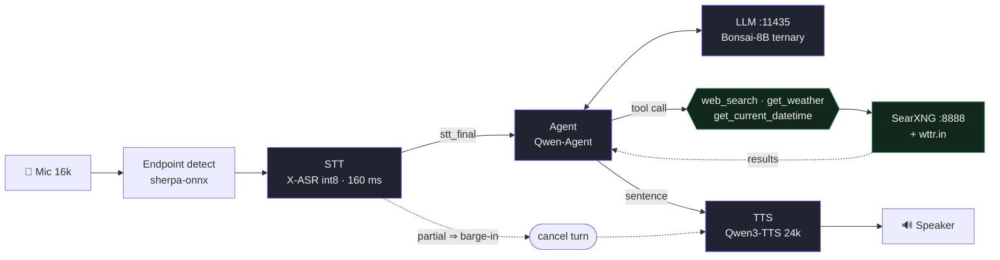

# Voice Chat — Streaming Speech-to-Speech with Tools

**X-ASR-int8 → Bonsai-8B ternary (Qwen-Agent) → Qwen3-TTS.** Real models, no mocks, low latency.

Speak, interrupt it mid-sentence by voice *or* text, search the web, hear the answer.
**Traditional Chinese (Taiwan) by default** — input and output are zh-TW whatever language the
question was asked in, with English kept only for proper nouns and untranslatable terms.



Every reply carries a monotonic `turn_id`; a superseded turn's events are dropped client-side.

## Stack

| Layer | Model / Service | Notes |
|---|---|---|
| **Turn-taking** | sherpa-onnx endpointing | trailing-silence rules drive `stt_final`; no separate VAD |
| **STT** | `GilgameshWind/X-ASR-zh-en` int8 | Zipformer, 160 ms streaming, 146 M encoder, zh+en 16 k, CUDA |
| **LLM** | `prism-ml/Ternary-Bonsai-8B` PQ2_0 (default) | llama-server `:11435`, `-c 16384`, thinking on, 3 tools |
| **Embedding** | `granite-embedding-97m-multilingual` Q8_0 | 384 d, zh-TW+en, `:11434`, semantic rerank |
| **TTS** | `Qwen/Qwen3-TTS-12Hz-0.6B-CustomVoice` Q8_0 | GGML CUDA, true streaming, 24 k, ~20 ms TTFA |
| **Search** | SearXNG `:8888` + wttr.in + Bing scrape | 180 engines, real results only |
| **Agent** | `qwen-agent` `Assistant` | `smolagents` / `PydanticAI` fallback harnesses |

Every import ladder ends in a mock adapter, so `app.py --mock` starts with no model libraries
installed; `/health` reports `mock` when a rung is reached.

### HuggingFace speech-to-speech is NOT used by default

Worth stating plainly, because the class name suggests otherwise. Nothing in the live path goes
through HuggingFace's speech-to-speech abstraction:

- **`HFSpeechToSpeechPipeline`** (`pipeline/speech_to_speech.py`) is the class the demo runs, but
  only as *this project's* orchestrator — the STT pump, the `turn_id`/barge-in state machine,
  sentence-level TTS flushing. The `HF` in the name is historical. It does expose an HF-style
  one-shot `__call__(audio_array, sampling_rate)`, but nothing in the repo calls it, and it is
  not equivalent to the live path: no streaming, no tools, no barge-in. Benchmark through it and
  you are measuring a different system.
- **`HF_OFFICIAL` mode** (`pipeline/hf_official.py`) is the real all-HF implementation —
  Paraformer, transformers text-generation, `pipeline("text-to-speech")`, no llama.cpp or sherpa.
  It is held to the same pump/`turn_id`/barge-in contract by `TestHFOfficialPipelineParity` and
  is **off** (`HF_OFFICIAL = False`); the downloads are slow and buy nothing the faster runtimes
  do not already give.

What HuggingFace *does* provide here is **weights**: every model above is an HF Hub download,
served through llama.cpp, sherpa-onnx and qwentts-cpp rather than through `transformers`. The
`pipeline()` API appears only on fallback rungs — a whisper ASR fallback in `stt/xasr_streaming.py`
and a SpeechT5 TTS fallback — which do not fire in a healthy deployment.

### Models

Switchable from the UI's Model card or `POST /api/model`. One loads at a time — VRAM on a 12 GB
card is tight with embedding + TTS + STT resident. **Bare-metal only**: compose runs the LLM in
a fixed sibling container.

| Model | bits/byte | file | tok/s |
|---|---|---|---|
| Qwen3.5 4B UD-Q8_K_XL + MTP | **0.8793** | 6.07 GB | ~60 |
| Qwen3.5 2B UD-Q8_K_XL + MTP | 0.9652 | 2.89 GB | 122 |
| **Bonsai 8B ternary** (default) | 1.0786 | 2.18 GB | 118 |

Bonsai is the default **by choice, not by metric** — the 2B scores better and uses half the
VRAM. Switch to it if answer fidelity matters more than running a 1.58-bit model. Bonsai also
inverts the usual size intuition: 2.18 GB of weights occupy 7.1 GB of VRAM at 16 k context.

**Bonsai needs Prism's llama.cpp fork**, which is why a registry entry may carry its own `"bin"`:
their `Q2_0` reuses upstream's `GGML_TYPE_Q2_0` id with a different block layout, so mainline
refuses the file. Build the `prism` branch with `-DGGML_CUDA=ON` (their README says CPU/Metal
only — out of date) and point `LLAMA_SERVER_BIN_PRISM` at it. Set `TMPDIR` to a real disk first
or nvcc hits the `/tmp` quota. The HF repo also ships a plain `*-Q2_0.gguf` in a *legacy*
group-128 layout that fails even on the fork; `PQ2_0` is the current one.

## Quick Start

```bash
# 1) Embedding
llama-server -m granite-embedding-97M-multilingual-r2-Q8_0.gguf \
  --host 127.0.0.1 --port 11434 -c 8192 --alias granite-embedding --embedding --pooling mean --n-gpu-layers 99

# 2) LLM — optional; the backend spawns and owns this itself if :11435 is free, or adopts it.
#    Note the binary: the default model is Bonsai, which mainline llama.cpp cannot read.
/home/user/prism-llama/build/bin/llama-server -m /home/user/llms/bonsai/Ternary-Bonsai-8B-PQ2_0.gguf \
  --host 127.0.0.1 --port 11435 -c 16384 --alias bonsai-8b --n-gpu-layers 99 --jinja \
  --reasoning-format deepseek

# 3) Search
SEARXNG_SETTINGS_PATH=/tmp/searxng/settings.yml python3 -m searx.webapp   # :8888

# 4) Backend + 5) Frontend
cd backend && python3 app.py --port 8000        # http://127.0.0.1:8000/health
cd frontend && npm install && npm run dev       # http://localhost:5173
# prod: npm run build — the backend serves frontend/dist at /
```

Model files: LLM `/home/user/llms/bonsai/Ternary-Bonsai-8B-PQ2_0.gguf` and
`/home/user/llms/mtp/Qwen3.5-{2B,4B}-UD-Q8_K_XL.gguf` · Embedding `/tmp/granite-emb-gguf/…Q8_0.gguf` ·
TTS `/tmp/qwen3_tts/talker_cv_q8.gguf` + `codec.gguf` · STT `/tmp/XASR/deployment/models/chunk-160ms-model/` ·
SearXNG `/tmp/searxng/settings.yml`.

> **`/tmp` here is tmpfs — it is RAM, and it enforces a quota.** A multi-GB write fails partway
> with `Disk quota exceeded` even though `df` shows free space. Put new weights on a real disk
> and point the matching `LLM_PATH_*` at them.

```bash
docker compose up -d --build     # UI at http://localhost:8000
```

## Features

- **Full-duplex barge-in, either direction.** Speaking over a reply cancels it — voice over
  voice, voice over text, or the button — on the *first partial transcript*, not when the user
  stops talking. That distinction is the whole feature on a long answer.
- **Tool-aware.** `web_search`, `get_weather`, `get_current_datetime`, with pre-flight routing
  for questions whose form requires a lookup.
- **zh-TW first.** Default voice, UI text and demo prompts are Traditional Chinese; the display
  layer uses OpenCC's phrase-aware `s2twp` as a safety net.
- **Thinking shown, never spoken.** Deliberation streams to a collapsible panel, kept out of
  both the audio and the transcript.
- **Low latency.** Svelte 5 + AudioWorklet + binary WS, whole-sentence TTS flush, 0.6 s pre-roll.

## Measured (RTX 3060, live stack)

| Metric | Value |
|---|---|
| STT accuracy | 100 %, CER 0.000 (`asr_example.wav`, 5 runs) |
| First audio — plain / tool turn | 0.4–2.0 s / 1.5–7.0 s (search round-trip dominates, not decode) |
| LLM TTFT (p50) · TTS TTFB (p50) | 0.05–0.58 s · 0.34–0.88 s |
| E2E (p50 / max) | 1.3–2.7 s / 7–19 s (whole answer synthesized, so it scales with length) |
| Barge-in | 3/3 — text→text, voice→voice, voice→text |
| Tool-call selection | 83 % mean, 71–100 % over 6 passes |
| RSS | ~3.0 GB idle, ~3.3 GB peak |

Tool routing is temperature-sensitive: every number is a spread, not a point. Fix
`LLM_AGENT_SEED` to compare builds.

**Thinking on vs. off** (3 passes each) — off is 7× faster to first token and *worse*, because
its failures are fabrications rather than misses:

| Config | Tool accuracy | TTFT p50 | What the user heard |
|---|---|---|---|
| thinking in `content` | 81 % | 1384 ms | answers, plus the scratchpad read aloud |
| thinking off | 71 % | 56 ms | fast, clean, invented: weather never looked up |
| thinking + `--reasoning-format deepseek` | **83 %** | **53–576 ms** | answers only |

**Two rules for comparing models**, both learned the hard way:

- *Perplexity ranks only models sharing a tokenizer.* It is per-token, so a tokenizer packing
  more text per token predicts a harder target and scores worse without being worse — Bonsai
  turns the eval corpus into 131 k tokens where Qwen produces 117 k. Across families use
  **bits per byte**: `tokens × ln(PPL) / (ln 2 × corpus_bytes)`. Numbers above are
  `llama-perplexity -c 2048` over 194 kB of non-repeating zh Wikipedia prose.
- *The four-prompt matrix cannot rank builds.* Two runs of the same weights differing only by a
  throughput feature scored 6/8 and 4/8; four near-equivalent configs gave 4, 5, 6, 4. At n=8
  and temperature 0.7 that is the noise floor. Treat it as an end-to-end smoke test.

**MTP** (Qwen entries): the weights carry NextN layers, so the model drafts its own next tokens
and the target verifies them — accepted drafts are what would have been generated anyway.
Measured +20 % on 4B with byte-identical greedy output. `LLM_MTP=0` disables it; `--spec-type`
is probed, so a build without it still starts.

To make a turn feel faster, look at the thinking budget and the search round-trip, not the model
size — decode is a small fraction of first audio.

## Design notes

Each rule exists because the obvious version misbehaved in a way that reached the user.

**Nothing the machine says to itself is an answer.** Reasoning reaches the client as its own
`reasoning` event, never as speech. Four other things look like answers and are not: our system
prompt replayed back (matched by shingle overlap, so paraphrases are caught), qwen-agent's
Simplified-Chinese tool narration, the model's own checklist scaffolding (`Evaluate the Input:`),
and any standalone sentence-length all-English span — answers here are zh-TW with English only
*inside* a Chinese sentence. Detection is shape-based, never a list of observed phrases.

A single token is too small a unit to classify, so a sentence recognized as reasoning only after
streaming is *retracted* from the transcript as well as withheld from speech
(`ling_streaming.retract_span`). Both paths accumulate `text_so_far` locally — adopting the
harness's cumulative copy restores what was just removed. If nothing survives, the turn falls
back to a spoken "no answer" rather than showing scaffolding in silence.

**Nothing is said twice.** The harness streams deltas live, then reconciles against the
authoritative final text and speaks only the remainder. Two ways that broke: comparing raw
streamed text against a whitespace-collapsed `final_text` (any answer opening with a newline
replayed in full), and `final_text` being a filtered *subset* of what streamed, once reasoning
sentences are dropped. Both sides are normalized and containment is checked first
(`tests/test_stream_replay.py`). Audio was always fine — `SpokenGuard` refuses a repeat — so this
only ever showed in the transcript, which is why it read as model repetition for so long.

**The language instruction is stated once, in the system prompt**, never appended to the user's
turn. Glued onto the transcript it became part of what the model was asked: copied verbatim into
`web_search` queries and read back aloud as the answer.

**Some questions are routed by form, not the model's judgement.** The current date and a current
office holder are no more in the weights than tomorrow's weather, so
`required_tool_for_request()` invokes the tool before the model speaks. The Chinese patterns
match ordinary word order (`總統是誰`) as well as verb-first `誰是`; matching only the latter left
this demo's own `法國現在的總統是誰？` chip answered from memory. Lookup intent is tested before the
clock so `現在` doesn't become a time query. `_preflight_enabled()` turns it off to measure the
bare model.

Three repair guards catch assertions nothing verified: a tool the model only *named*, a
fabricated clock, and a fabricated forecast. Each runs the real tool — visible in the UI via its
own events — and either splices the value in or takes one corrective turn. A pre-flighted tool
counts as a tool that ran, or the guards fire on correct answers.

**Markdown is not speech.** Handing `**bold**` to an acoustic model produced 65 % CER on those
sentences. `tts/spoken_text.py` is the single front-end for both TTS entry points; it rewrites
notation only (markup, `°C`→`度`, `68%`→`百分之68`, emoji, URLs), never content, and reports which
rules fired. Text is then segmented by script and synthesized with an explicit per-segment
language, so a term quoted mid-sentence isn't pronounced as Chinese.

**Search is honest.** No curated results. Chinese queries are tokenized with jieba before
relevance scoring — a regex treats an unsegmented phrase as one token, which scored every Chinese
query at zero and silently disabled the fallback chain. Fallback backends race concurrently
rather than each waiting out its own timeout.

## Configuration

| Env | Default | Purpose |
|---|---|---|
| `VOICE_CHAT_TOKEN` | — | auth token (`--token` alias) |
| `ALLOWED_ORIGINS` / `ALLOW_CREDENTIALS` | dev origins / off | CORS |
| `WS_ALLOW_ANY_ORIGIN` | off | opt out of the WebSocket Origin gate |
| `SEARXNG_URL` | `http://localhost:8888` | search backend |
| `LLM_API_BASE`, `LLM_PORT`, `LLM_CTX`, `LLM_DEFAULT_MODEL_ID`, `LLM_PATH_*` | see `llm_manager.py` | LLM subprocess |
| `LLAMA_SERVER_BIN_PRISM` | `/home/user/prism-llama/build/bin/llama-server` | fork the Bonsai entry runs on — **required for the default model** |
| `LLM_MTP` / `LLM_MTP_DRAFT_N` | `1` / `3` | self-speculative decoding on MTP weights |
| `LLM_SEED` / `LLM_AGENT_SEED` | random / unset | reproducible runs |
| `LLM_AGENT_TEMP`, `LLM_AGENT_TOP_P` | `0.7`, `0.9` | agent-turn sampling |
| `LLM_AGENT_THINKING` | `1` | thinking pass on agent turns |
| `LLM_AGENT_NO_TOOL_SMALLTALK` | `1` | greetings get a reply, not a tool call |
| `LLM_REASONING_FORMAT` | `deepseek` | keeps thinking out of `message.content` |
| `VOICE_TZ` | `Asia/Taipei` | timezone spoken by the datetime tool |
| `EMBED_API_BASE`, `EMBED_MODEL` | `:11434` | semantic rerank |
| `TTS_MODEL_DIR`, `STT_MODEL_DIR` | `/tmp/…` | model locations (Docker mounts) |

## API

| Endpoint | Description |
|---|---|
| `GET /health` | models, RSS, mock flag, SearXNG status, auth mode. Public; `?verbose=1` adds latency history and needs a token |
| `WS /ws/chat?session_id=…` | binary PCM (`0x01` audio / `0x02` flush / `0x03` barge-in) or JSON (`start`/`audio_chunk`/`stop`/`barge_in`/`text_input`) → `stt_partial`/`stt_final`/`llm_token`/`llm_reset`/`reasoning`/`tool_call`/`tool_result`/`tts_start`/`tts_chunk`/`tts_end`/`latency`/`barge_in`, each tagged with `turn_id` |
| `POST /api/chat` | JSON chat (non-streaming) |
| `GET /api/search?q=…` | SearXNG search |
| `GET /stats` | counters and latency percentiles |
| `GET` / `POST /api/model` | list / switch the loaded LLM (~1–2 s). Loopback-only unless a token is set |

`llm_reset` tells the client to discard a partial bubble: the agent can stream text then withdraw
it when a tool call appears mid-stream. Nothing withdrawn was ever spoken.

## Security

| Control | Default |
|---|---|
| `VOICE_CHAT_TOKEN` | unset = open dev mode. When set, `/api/*`, `/ws/chat`, `/search`, `/stats` require `X-Auth-Token`, `Authorization: Bearer`, or `?token=` |
| Model switching | loopback-only without a token — it restarts llama-server and silences every session |
| CORS | explicit dev-origin list, no credentials; wildcard + credentials refused and logged |
| WebSocket handshake | 403 before `accept()` unless the Origin is same-origin, loopback, or allow-listed. **CORS does not cover WebSockets** — without this any page could open a live mic session from a visitor's browser |
| `/search?format=html` | output escaped; only `http(s)` becomes a link |

Publishing this port? Set `VOICE_CHAT_TOKEN` first — the backend warns at boot when bound to a
non-loopback host without one.

## Validating a change

```bash
python3 -m unittest discover -s backend/tests -v   # pure logic, no GPU/network (CI)
python3 backend/check_env.py                       # is this interpreter complete?
python3 backend/check_requirements.py              # will the pins install in the image?
ruff check backend --config ruff.toml              # gate: E4, E7, E9, F, B

# against a LIVE deployment
python3 backend/test_e2e_report.py --server http://127.0.0.1:8000
python3 backend/test_bargein_voice.py              # speak over a long reply; must cut it dead
python3 backend/test_tts_asr_roundtrip.py --tts qwen3 --repeats 3 --modes full,stream
python3 backend/compare_tts_reports.py before.json after.json

docker build --target smoke --build-arg INSTALL_MODE=light -t voice-chat-smoke .   # the CI job
```

`backend/tests/` exists because the bugs that actually shipped — CJK relevance scoring, truncated
tool-call JSON, wrong-language TTS segments — were all in pure functions nothing tested.
`INSTALL_MODE=full` and in-container CUDA remain uncovered; both need a GPU host.

Pronunciation is measured, not argued: `test_tts_asr_roundtrip.py` synthesizes, re-transcribes and
reports CER per category against the ASR's own floor (10.5 % paced / 5.3 % one-shot). Read results
as `cer − floor`, and treat any category delta under ~7 pp at n=4 as a tie.

Writing your own UI-level sweep? Two things are easy to get wrong: **assert on what the UI
renders** (mirror `handleServerMessage` — a version accumulating `token` while the frontend renders
`text_so_far` reported 12/12 green against a transcript no user sees), and **check the answer
bubble separately from the audio**, since reasoning kept out of speech can still sit in the
transcript.

## License

Code Apache-2.0. Models: Qwen3.5, Qwen3-TTS, Granite-embedding-97M, X-ASR-int8, Bonsai
(Apache-2.0); SearXNG AGPL-3.0.
